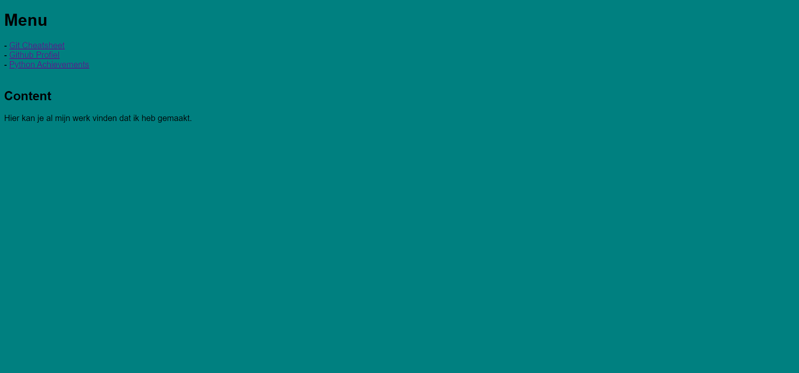
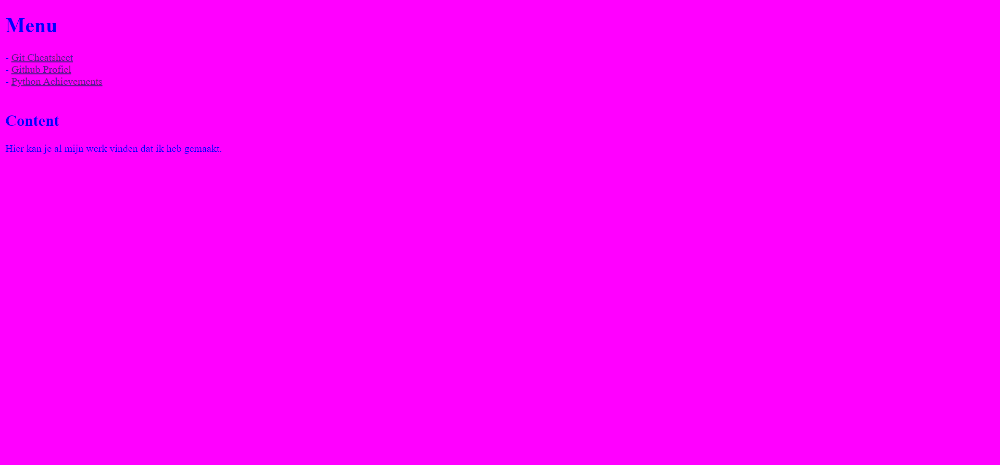

# Website Veranderen met Debugger

## Voor en na afbeeldingen:

### Voor:

### Na:

## Hoe ik het heb gedaan:

### Ik heb in de console van Google Chrome "document.body.style.fontFamily = "Times New Roman"" gebruikt voor het lettertype.
### "document.body.style.backgroundColor = "#FF00FF"" voor de achtergrondkleur.
### En "document.body.style.color = "#0000FF"" voor de tekstkleur.